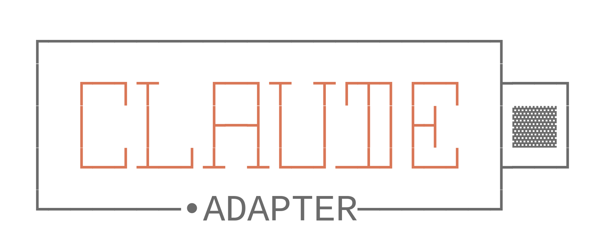

<div align="center">

# Claude Adapter



**Adapt any model for Claude Code**

[](https://www.npmjs.com/package/claude-adapter)
[](https://codecov.io/gh/shantoislamdev/claude-adapter)
[](https://opensource.org/licenses/MIT)
[](https://nodejs.org)

[Getting Started](#getting-started) •
[Installation](#installation) •
[Configuration](#configuration) •
[API Reference](#api-reference) •
[Contributing](#contributing)

</div>

---

## Overview

**Claude Adapter** serves as a sophisticated middleware solution designed to bridge the interoperability gap between the Anthropic Messages API and the OpenAI Chat Completions ecosystem. By functioning as a transparent proxy, it enables **Claude Code**—Anthropic's command-line interface—to leverage the capabilities of any OpenAI-compatible large language model (LLM), regardless of the provider.

This adapter effectively "tricks" Claude Code into communicating with models it was not natively designed to support, handling all necessary protocol translations, header modifications, and payload restructuring in real-time.

### Key Features

- 🔄 **Protocol Translation Layer** — Implements a robust bi-directional conversion engine that maps Anthropic's message format to OpenAI's chat completion schema on the fly.
- 🌊 **Server-Sent Events (SSE) Streaming** — Provides full support for real-time response streaming, ensuring that the interactive feel of Claude Code is preserved even when backend by different models.
- 🛠️ **Tool Invocation Compatibility** — seamlessly translates tool definitions and function call requests, allowing complex agentic workflows to function correctly across model boundaries.
- ⚡ **Zero-Configuration Initialization** — Features an interactive CLI setup wizard that automates the generation of configuration files and environment variables.
- 🔌 **Transparent Proxying** — Operates non-intrusively as a local service, requiring no modifications to the core Claude Code binary or internal logic.

---

## Architecture

The adapter operates as a local HTTP server that mimics the Anthropic API structure while forwarding requests to an upstream OpenAI-compatible target.

```
┌─────────────┐      ┌─────────────────┐      ┌─────────────────┐
│              ────▶                   ────▶                   │
│ Claude Code │      │  Claude Adapter │      │ OpenAI Endpoint │
│               ◀────                   ◀────                  │
└─────────────┘      └─────────────────┘      └─────────────────┘
   Anthropic              Converts                  OpenAI
    Format                Formats                   Format
```

When Claude Code initiates a request, **Claude Adapter** intercepts it, transforms the payload (including system prompts, message history, and tool definitions) into a format compliant with the OpenAI specification, and dispatches it to the configured backend (e.g., OpenAI, Grok, or a local inference server). The response is then captured, re-serialized into the Anthropic message format, and returned to the client.

---

## Getting Started

### Prerequisites

- **Runtime Environment**: Node.js Version 20.0.0 or higher is required to execute the adapter.
- **API Access**: A valid API key for an OpenAI-compatible service (e.g., OpenAI, DeepSeek, XAI).

### Installation

To install the adapter globally on your system, execute the following command:

```bash
npm install -g claude-adapter
```

### Quick Start

1. **Initialize the Service:**
   Launch the adapter's interactive setup utility:
   ```bash
   claude-adapter
   ```

2. **Configuration Wizard:**
   The CLI will guide you through the necessary configuration steps:
   - **Base URL**: Enter the endpoint URL of your compatible provider.
   - **Authentication**: Securely input your API key.
   - **Model Mapping**: Define which OpenAI-compatible models should be aliased to Claude's internal identifiers (`opus`, `sonnet`, `haiku`).

3. **Operational State:**
   Once configured, the adapter will start a local proxy server. Claude Code is automatically reconfigured to route traffic through this local endpoint.

---

## Configuration

### CLI Options

The CLI accepts several flags to customize runtime behavior:

| Option              | Description                                   | Default |
| ------------------- | --------------------------------------------- | ------- |
| `-p, --port <port>` | Specifies the port for the local proxy server | `3080`  |
| `-r, --reconfigure` | Forces the specific reconfiguration workflow  | `false` |
| `-V, --version`     | Output the current version information        | —       |
| `-h, --help`        | Display available commands and options        | —       |

### Model Mapping Configuration

The core of the adapter's flexibility lies in its ability to map Claude's expected model tiers to arbitrary upstream models. This allows you to substitute, for example, a specialized coding model for `sonnet` or a high-speed inference model for `haiku`.

| Claude Tier | Intended Use Case | Example Mapping Strategy       |
| ----------- | ----------------- | ------------------------------ |
| `opus`      | Complex reasoning | `gpt-4`, `grok-1`              |
| `sonnet`    | Balanced tasks    | `gpt-4-turbo`, `deepseek-chat` |
| `haiku`     | Low-latency ops   | `gpt-3.5-turbo`, `llama-3-70b` |

---

## API Reference

### Programmatic Integration

For users wishing to embed the adapter within larger Node.js applications, the package exports its core server factory:

```typescript
import { createServer, AdapterConfig } from 'claude-adapter';

const config: AdapterConfig = {
  baseUrl: 'https://api.openai.com/v1',
  apiKey: process.env.OPENAI_API_KEY!,
  models: {
    opus: 'gpt-4',
    sonnet: 'gpt-4-turbo',
    haiku: 'gpt-3.5-turbo'
  }
};

// Instantiate the proxy server
const server = createServer(config);

// Start listening on a specific port
await server.start(3080);

console.log('Proxy running on http://localhost:3080');
```

> **Note**: While the adapter exposes this programmatic interface, its primary design intent is to function as a standalone CLI tool for Claude Code users.

### Transformation Utilities

The underlying conversion logic is also exposed as standalone functions for custom implementations:

```typescript
import { 
  convertRequestToOpenAI,
  convertResponseToAnthropic 
} from 'claude-adapter';

// Transform an incoming Anthropic request payload
const openaiRequest = convertRequestToOpenAI(anthropicRequest, 'target-model-name');

// Transform an OpenAI response payload back to Anthropic format
const anthropicResponse = convertResponseToAnthropic(openaiResponse, 'original-model-name');
```

For detailed type definitions and function signatures, please consult the [API Documentation](./docs/API.md).

---

## Supported Features

| Feature Capability    | Support Status | Implementation Notes       |
| --------------------- | :------------: | -------------------------- |
| Text Generation       |       ✅        | Full fidelity              |
| System Prompts        |       ✅        | Mapped to 'system' role    |
| Real-time Streaming   |       ✅        | SSE event translation      |
| Tool/Function Calling |       ✅        | Bidirectional mapping      |
| Context Preservation  |       ✅        | Multi-turn history support |
| Token Limits          |       ✅        | Parameter pass-through     |
| Sampling (Temp/Top P) |       ✅        | Parameter pass-through     |
| Stop Sequences        |       ✅        | Mapped to API equivalent   |
| Multimodal (Vision)   |       🔜        | Implementation roadmap     |

---

## Troubleshooting

### Common issues and Resolutions

<details>
<summary><strong>EADDRINUSE: Port collision</strong></summary>

If the default port `3080` is occupied by another process, launch the adapter on an alternative port:
```bash
claude-adapter --port 3000
```
</details>

<details>
<summary><strong>Authentication Failures</strong></summary>

If you encounter 401 errors, your API key may be invalid or expired. Rerun the configuration wizard:
```bash
claude-adapter --reconfigure
```
</details>

<details>
<summary><strong>Connection Refused</strong></summary>

Ensure the proxy server is running in a terminal window. Check your `~/.claude/settings.json` to verify the `ANTHROPIC_BASE_URL` is pointing to the correct local address (e.g., `http://localhost:3080`).
</details>

---

## Development

To contribute to the codebase or build from source:

```bash
# Clone the repository
git clone https://github.com/shantoislamdev/claude-adapter.git
cd claude-adapter

# Install dependencies
npm install

# Start the development server with hot-reload
npm run dev

# Execute the test suite
npm test

# Compile TypeScript to JavaScript for production
npm run build
```

Please refer to [CONTRIBUTING.md](./CONTRIBUTING.md) for comprehensive contribution guidelines.

---

## License

This project is licensed under the **MIT License**. For full terms and conditions, please see the [LICENSE](./LICENSE) file.

---

<div align="center">

**[Report Bug](https://github.com/shantoislamdev/claude-adapter/issues)** •
**[Request Feature](https://github.com/shantoislamdev/claude-adapter/issues)** •
**[Documentation](./docs/)**

Made with ❤️ by [Shanto Islam](https://shantoislamdev.web.app/)

</div>
